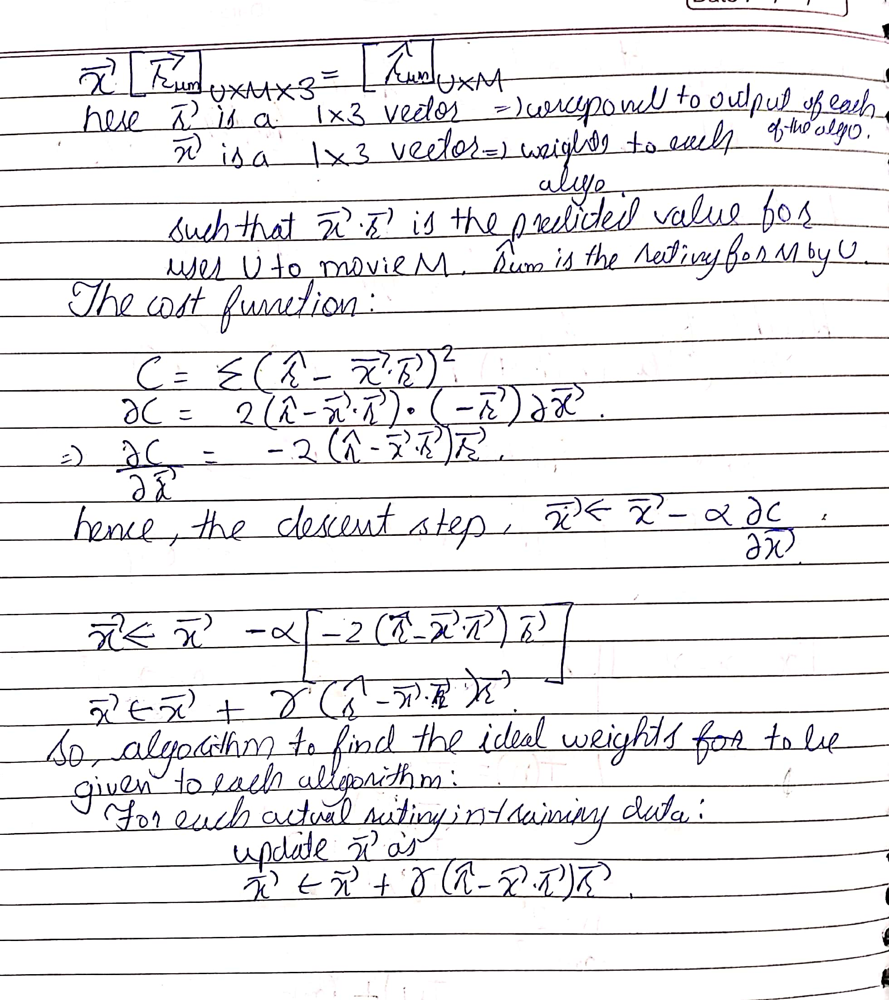

# Cinendorse
Cinendorse gives movie recommendations to the users based on data collected from them in the form of ratings to movies from a database of 5000 movies. It takes into consideration 3 different algorithms to give recommendations. It is hosted in a Docker container in Heroku. (Docker container created from ). The website is hosted at [Cinendorse](https://cinendorse.herokuapp.com "Cinendorse")

The Database is hosted on an mLAb server at [mLab-deploy_2](https://mlab.com/databases/deploy_2)
Please use the credentials:
Username : Review
Password : reviewCom1000

## Data Collection
For the purpose of collecting data on movies, I wrote the  script, which takes an integer i as input, and scrapes data for i pages from the IMDB advanced search pages, each having 250 movie, which display all the details about the movies in a single page. I chose to scrape data for the "Most Rated" movies, and not "Highly Rated Movies" so as to ensure that my database does get almost all relatable movies to the target userbase around me.

I chose to work totally on primary data, for which I chose to create the very minimalistic website very early, so as to get primary data on movie ratings from a lot of people I know. The movies displayed for being rated, half of them have been rated by at least one other user, and the other half were randomly picked from a list of movies not rated. This ensured that I got overlapping ratings as well as ratings on more movies in the database.

I was able to collect Data under the heads of "Title", "Year of release", "Synopsis", "License", "Thumbnail Image", "IMDB Rating", "Metascore rating", "Genre", "Run Time", "Directors" and "Cast".

I was able to get 830 Ratings on these movies from about 133 users at the time of this writing.

## Usage
When opened, the user is greeted with a form to create a username. I chose not to create a login with a password, as it would have prevented people from signing up and voting, and also because this wouldn't be a security issue. The user creates a username and is then shown a list of Movies to rate. The user is expected to rate only those movies they watched and give ratings according to their own personal understanding.

In another tab, the user can see the movies recommended to them based on the algorithm they choose(through a drop down present). As the user submits more ratings, the recommendations change, and gradually get better.

To run the web server, cd into the project root, then:
```
    export FLASK_APP=server
    flask run -h 0.0.0.0
```
## Algorithms
### User User Collaborative Filtering
The algorithm maintains the similarity score between a user with each other. For the active user, the algorithm selects "k"(currently 5) most similar users, and all the movies they have rated( Similarity is based on cosine similarity on normalized ratings vector). Then the algorithm determines the expected rating the active user would give to the movies among those to be considered. It sorts the list and returns top n.
It is implemented in the u2_collab function in 

### Item Item Collaborative Filtering
The algorithm identifies all the movies in the database which have at least one rating and which have not been rated by the active user. For each such movie, it finds the similarity of the active movie with all other movies rated by the active user. For each such movie, if the similarity>0, then the rating is included in the weighted mean of the ratings. At the end, this normalized expected rating is added to the mean rating of the current movie. The list of such movies is then sorted based on rating and top n are returned.
This algorithm is implemented in the file 

### Matrix Factorisation
The algorithm uses a modified version of Funk SVD.
In this, the algorithm forms a matrix where the rows represent User rating vectors and Columns represent Movie rating vectors, hence, the element(u, m) of the matrix R is the rating given by user U to movie M. We hypothesise that this matrix(Sparse) can be factorised as a product of 2 latent matrices U and M, where the rows of U represent the latent vector of user u, and columns of M represent movie M. The current number of latent factors is 10. We fill this up with values picked from a gaussian distribution of mean 0 and standard deviation 1. We then perform gradient descent to minimize the cost function C, which is the aggregate squared error, based on all the actual ratings given. The trained U and M are constantly saved. The modification from Funk SVD is in the fact that the algorithm updates both U and M at each step of the descent for each data point, rather than first going for U and then M.
Everytime a new rating is provided to the system, 10 epochs of descent are elapsed, at a learniong rate of 0.001.
Everytime a new user joins the system, his latent vector is initialized with random values drawn from the said Gaussian distribution.
This is implemented in 

## Libraries Used
This project relies on Flask with Jinja for handling the web display and serving of pages. The algorithms use Pandas, and Numpy libraries, to maintain the various matrices and vectors, and for the calculation of dot products. The project relies on a MongoDB database hosted on mLab.

## Major Learnings
This was my first experience with a full fledged web project. Also, I had never before worked on Machine Learning algorithms. To get an opportunity to code the entire algorithm from scratch was a wonderful experience. This was also my first time working on a project with deployment at heroku. One major issue faced was that of the limited memory provided, and for quite some time, my application was showing a memory excess error. After a lot of optimizations, I was able to bring it down by 90%. While looking for a solution, I also found out about worker processes, however, since it was very late, I decided not to implement those, but, nevertheless, I read up about it and how it could help in my situation.

This was my first time using flask, numpy, and also the MongoDB database. Hence, it was filled with learning experience for me.

I wanted to use a gradient descent algorithm to find the weights to be given to the output of each algorithm, using the ratings data as a training model and did calculations for it, however, since I couldn't put in the time to train the model, I did not implement it.

<p align="center">
  
</p>

